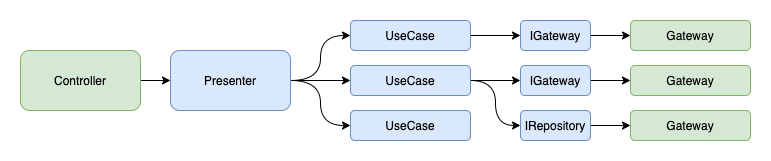

# Atwork API  🏢

Spring application written in Kotlin [atwork](https://github.com/Creditas/atwork-api) application

For now, this application is more than a backend for frontend as it holds some business logic.

## Contributing

Anyone is welcome to participate but first please take a look at the [contributing guidelines](CONTRIBUTING.md).

## Configuration

After download the repository you need to configure the credentials for `jfrog`. If you don't have that credentials you can ask for them to [Service Desk](https://creditas.atlassian.net/servicedesk/customer/portals). 

Then you can go to your `$HOME` and create a file named `gradle.properties` bellow a `.gradle` folder:

```
$HOME
  └─ .gradle
     └─ gradle.properties
```

Inside that `gradle.properties` file you should set up your credentials:

```
artifactory_contextUrl=https://creditas.jfrog.io/creditas
artifactory_user=yyyyyyyy
artifactory_password=xxxxxx
```

## Where I can find this service on the internet?

This service is under Creditas' Kong gateway and requires a valid JWT token to be accessed:

* Production: https://kong.prod.creditas.io/atwork/
* Staging: https://kong.stg.creditas.io/atwork/
* Development: https://kong.dev.creditas.io/atwork/

## Basic architecture

This project follows an architecture similar to [Model View Presenter](https://en.wikipedia.org/wiki/Model-view-presenter). However, it is a more simplified version.



A few things to note about it:

* The `Controller`, `Gateway` and `Repository` are the outer world. Everything in between is what happens inside the application's domain.
* Decouple business logic from the `Controller` and from any framework related dependency by delegating to a `Presenters` as fast as possible.
* `UseCase` or `Action` are composable small pieces of business logic. A `Presenter` will combine them to achieve more complex business cases.
* A `UseCase` is a verb. It is a class, and not a function, only because Dependency Injection is easier that way. Actually we advise you to use the `invoke operator`.

## Documentation

This API relies in [springdoc-api](https://springdoc.org/#Introduction) to provide a [Swagger UI](https://swagger.io/tools/swagger-ui) with the endpoint documentation.

Swagger UI can be accessed [here](https://atwork-api.stg.creditas.io/swagger-ui.html) and requires you **to be connected to Creditas VPN**.
